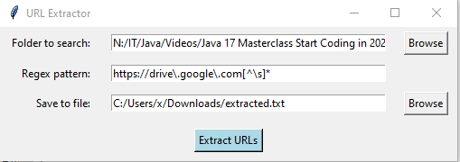

# PyURLExtractor
A Tkinter GUI to clone to tracerse recursively down a passed in directory and extract all URLs from files based on a RegEx pattern,

## Pre-requisites:
None

## Usage
Navigate to the directory where the script is located and run it as:
```
python .\PyURLExtractor.py
```
## Screenshots
\

